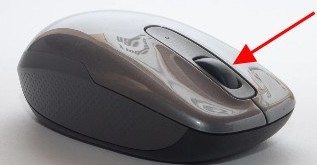
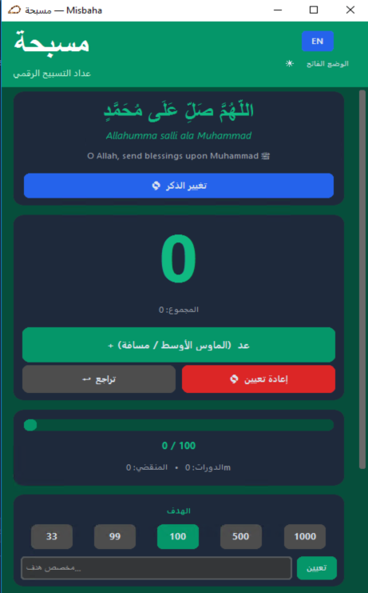

<p align="center"></p>

## Misbaha – Digital Tasbih Counter

Misbaha is a **desktop tasbih/dhikr counter** built with `customtkinter`.  
It lets you **keep counting your dhikr without leaving whatever app you are using** by using the **middle mouse button** or a **global keyboard shortcut**.

> Prefer Arabic? See the Arabic README: [`README-ar.md`](README-ar.md)
>
> **Make your middle mouse button truly useful.**





### Main features

- **Middle mouse counting**:  
  Press the middle mouse button (scroll wheel) anywhere and Misbaha will increment your counter in the background.
- **Global keyboard shortcut**:  
  Optionally use a customizable key combo (for example `Ctrl+Space`) instead of the mouse.
- **Beautiful, modern UI**:  
  Clean card‑based layout using `customtkinter`, with smooth counter and progress animations.
- **Arabic & English**:  
  Switch instantly between Arabic and English labels from inside the app.
- **Dark & light themes**:  
  Toggle theme with one click; your choice is remembered.
- **Predefined & custom adhkar**:  
  Choose from common dhikr presets or add your own custom dhikr with target count.
- **Targets, cycles, and total**:  
  See current cycle progress, total count, and how many cycles you have completed.
- **Session saving**:  
  Save, load, and delete sessions so you can come back to a dhikr later.

---

## How it works

- Start the app.
- Select your dhikr and target.
- Make sure **“Middle Mouse”** (or your chosen keyboard shortcut) is selected as the active input.
- Now you can:
  - Keep your usual app (browser, editor, Qur’an app, etc.) in focus.
  - **Press the middle mouse button** whenever you want to increment the counter.
  - Watch your counts, cycles, and progress inside the Misbaha window.

The app runs a global listener via `pynput`, so clicks/shortcuts are captured even when Misbaha is not focused.

---

## Running the app in development

- **Prerequisites**
  - Python 3.10+ (3.11 is also fine)
  - `pip` installed
  - Windows is recommended (icons and beeps are tuned for Windows), but other platforms should work for basic counting.

- **1. Clone the project**

```bash
git clone https://github.com/Mostafa-Ben-Git/Misbaha.git
cd Misbaha
```

- **2. Create and activate a virtual environment (Windows PowerShell)**:

```bash
python -m venv .venv
.venv\Scripts\Activate.ps1
```

- **3. Install dependencies**:

```bash
pip install -r requirements.txt
```

- **4. Run the app**:

```bash
python app.py
```

The main window should open and start listening for the middle mouse button.

---

## Configuration storage

- **Where settings are saved**
  - The app stores your last state (current dhikr, counts, theme, language, sessions, and shortcut) in a JSON file:
    - **Generic path**: `~/.tasbih/tasbih_settings.json`
    - **On Windows**: typically `C:\Users\<YourUserName>\.tasbih\tasbih_settings.json`
- **Resetting the app**
  - To reset Misbaha back to defaults, you can close the app and delete `tasbih_settings.json`.  
    Next launch will recreate it with fresh settings.

---

## Using the app (step by step)

1. Start the app (`python app.py` or by running the built executable).
2. Choose your **dhikr** from the list or create a **custom dhikr**.
3. Set a **target** (33, 99, 100, custom, etc.).
4. Decide how you want to count:
   - Use the **middle mouse button** (default), or
   - Open **Change input** in the app and choose a **keyboard shortcut** such as `Ctrl+Space`.
5. Keep any other window in focus (browser, editor, PDF, etc.) and:
   - Press the middle mouse button (or your shortcut) each time you want to increment.
   - Watch the **counter**, **cycles**, and **progress bar** inside Misbaha.
6. Optionally:
   - Toggle **dark/light theme**.
   - Switch **language** between English and Arabic.
   - **Save sessions** and reload them later from the sessions card.

---

## Building a standalone executable (PyInstaller)

The app has built‑in support for PyInstaller. To build a single `.exe` (on Windows):

```bash
python app.py build
```

This will:

- Install `pyinstaller` if it is not available.
- Bundle the app into a single file executable named **`Misbaha`**.
- Include the icon (`asset/icon.ico`) and audio (`asset/audio.wav`) if they exist.

You can then distribute that executable to other Windows users.

---

## Contributing

Contributions are very welcome. Here is a suggested workflow:

1. **Fork** the repository on GitHub.
2. **Clone** your fork and set up the project using the steps in “Running the app in development”.
3. **Create a branch** for your change:

```bash
git checkout -b feature/my-improvement
```

4. Make your changes (for example: new dhikr presets, UI tweaks, bug fixes).
5. Run the app (`python app.py`) and test your changes manually.
6. **Commit** and **push** your branch:

```bash
git commit -am "Describe your change"
git push origin feature/my-improvement
```

7. Open a **Pull Request** from your branch to the main repository, briefly explaining:
   - What you changed
   - Why it improves the project
   - Any testing you performed

If you’re unsure where to start, good first issues include:

- Improving documentation (English or Arabic).
- Enhancing accessibility and keyboard navigation.
- Refining UI styling in `app.py`.
- Adding new useful dhikr presets.

---

## Notes

- Please avoid committing secrets (tokens, personal data, etc.).
- Try to keep the code style consistent with the existing `app.py`.
- If you change dependencies, update `requirements.txt` and explain why in your Pull Request.

---

## Feedback & issues

- **Bug reports & feature requests**:
  - Please open an issue on GitHub:  
    [GitHub issues page](https://github.com/Mostafa-Ben-Git/Misbaha/issues)
- **What to include**:
  - Your OS and Python version.
  - How you ran the app (dev or built executable).
  - Steps to reproduce the problem, or a short description of your idea.

Feedback is highly appreciated and helps keep Misbaha stable and useful.

